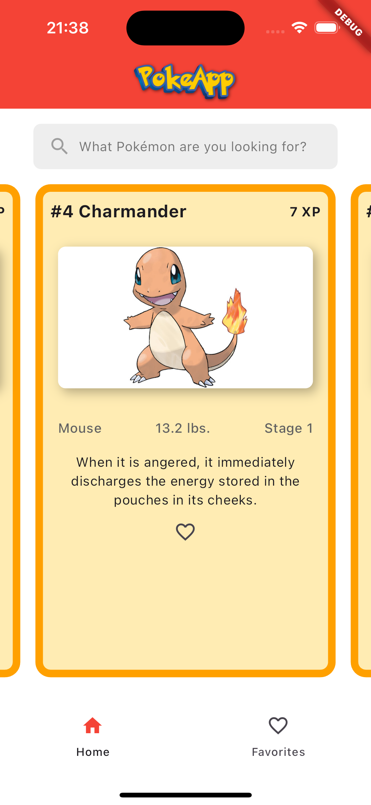
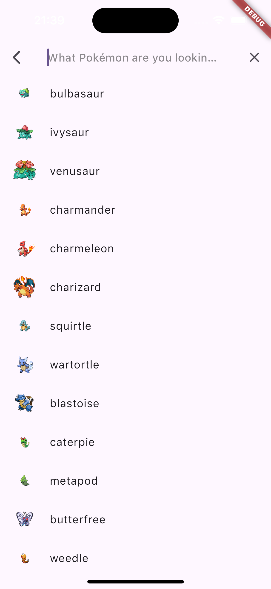
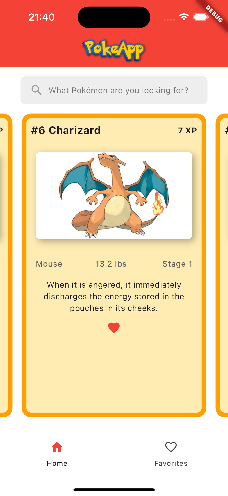
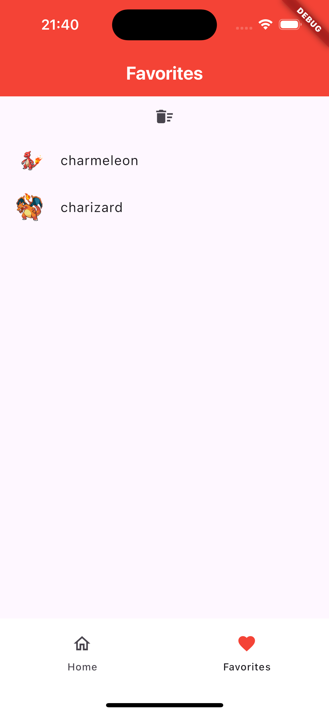
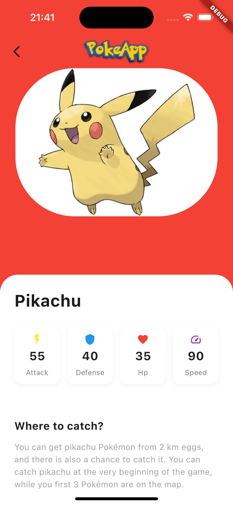

# Pokedex App

Built with Flutter, It's an app where you can find all the pokemons and will let you know learn about their abilities, strenghts and weaknesses.

The app Has been connected with the Api of Pokeapi, you can reach more about it in their documentation. [link here pokeapi docs](https://pokeapi.co/)

## The Architecture

This app can operate in OFFLINE MODE.

Pokedex App follows a *clean architecture* approach with a feature-first mindset. This allows for better separation of concerns, testability, and maintainability.

## Metodology

- Scrum: The project was developed using the Scrum framework, with regular sprints, daily stand-ups, and retrospectives.
- Git Flow: For managing code changes using feature branches, release branches, and master branch.

## Features

The app has a lot of features. You can find some of them in this repo, this app includes:

- *home_page*: Your favorites pokemons in cards were you can get relevant information about all of them

| HomePage |
|---|
| |

- *search_page*: You can find your favorite pokemon and get more information faster, simply, and friendly with your usability

| Search Page Image 1 | Search Page Image 2 |
|---|---|
|  |  |

- *favorites_page*: Your favorites pokemons in a dedicated page.

| Favorites Example 1 | Favorites Example 2 |
|---|---|
|  |  |

- *detail_pokemon_page*: Get the relevant information of your pokemon in one page. You will reach more about them in a exclusive and beautiful interface.

| Detail Example 1 |
|---|
|  |

## Initial Setup 

This project is a starting point for a Flutter application.

0. Fork and rate with a star this repo :D
1. Clone the repo from your fork
2. Make de command 'flutter pub get' 
3. Compile in your favorite simulator

### _Technology Stack_

#### State Management:
- BLoC: Business Logic Component pattern for managing the application state.
- Equatable: For efficient equality checks.
#### Data Persistence:
- Hive: For storing local data.
#### Networking:
- Dio: For making HTTP requests to fetch Pokémon data.
#### Image Caching:
- cached_network_image: For efficient image loading and caching.
#### Animations:
- lottie: For rendering After Effects animations.
#### Testing:
- mocktail: For mocking dependencies in tests.
- bloc_test: For testing BLoC components.

#### Build with Flutter & Dart @paolojoaquinp